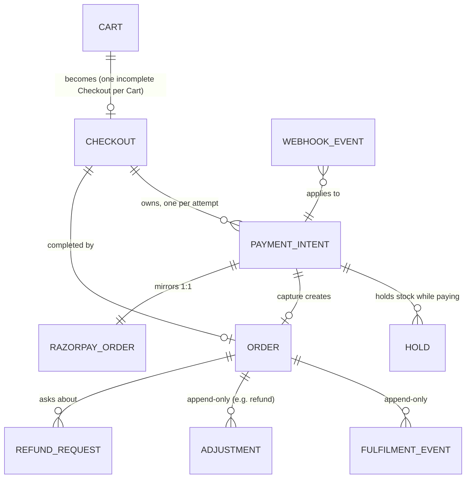
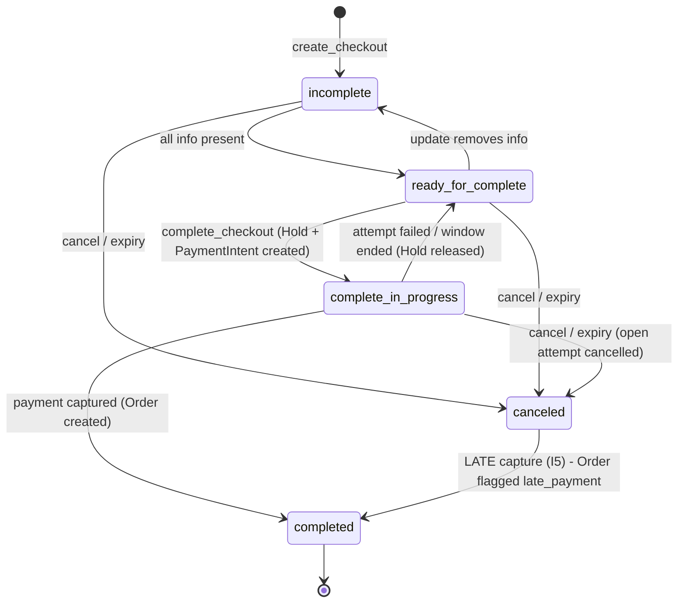
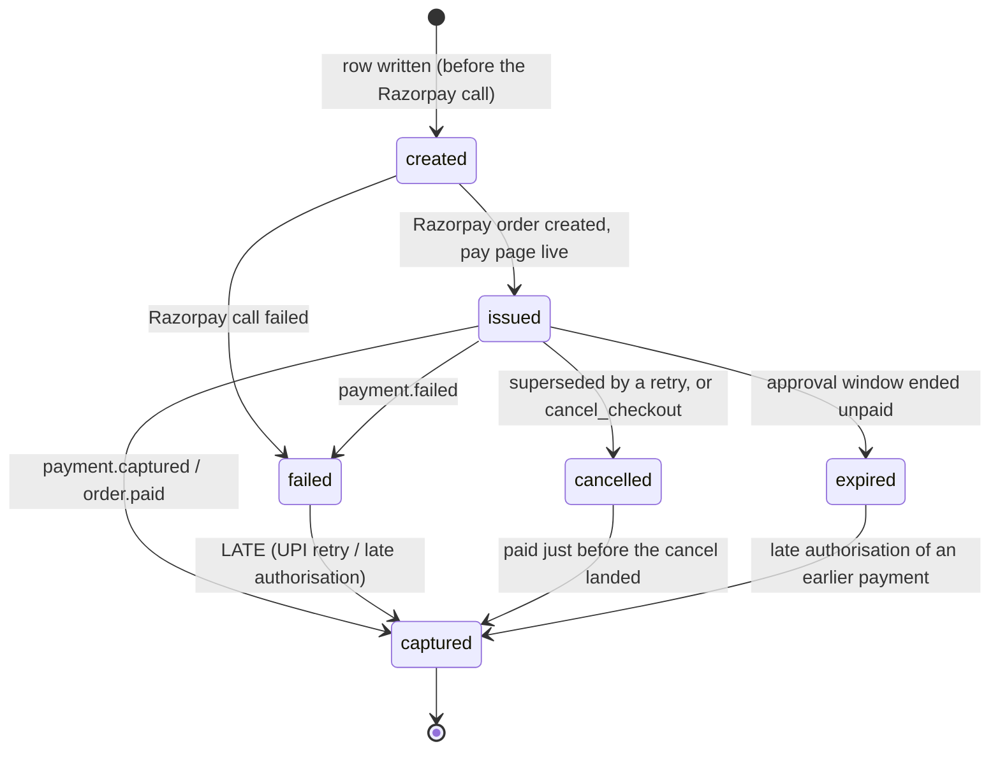
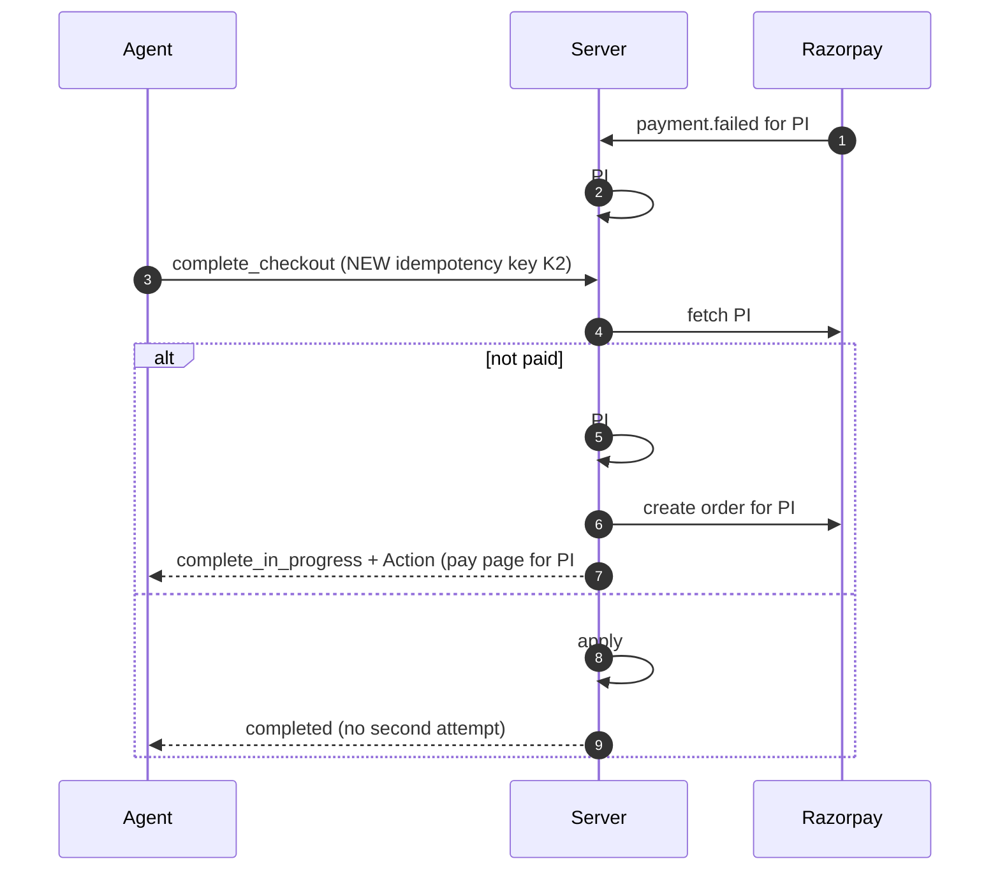

# Payments architecture

**Status:** decided in [#30](https://github.com/HarshilForWork/TillMan/issues/30) (4 Oct 2026) and [#16](https://github.com/HarshilForWork/TillMan/issues/16) (10 Oct 2026, the UPI handler, §11). Where older sections say "link", read the attempt's **pay page** (§11.2); Razorpay Payment Links are only the fallback. It's a living document: [#16](https://github.com/HarshilForWork/TillMan/issues/16) (the payment handler) and [#17](https://github.com/HarshilForWork/TillMan/issues/17) (payments in the eval suite) extend it when they're decided. Anything still open is marked **⏳ #N**.
**Short form:** ADR-0007. **Terms:** `CONTEXT.md`. **Spec:** UCP `2026-08-25`. **PSP:** Razorpay, test mode.

---

## 0. In one paragraph

A Customer's agent builds a **Cart**, turns it into a **Checkout** (prices are snapshotted), and calls `complete_checkout`. The server places a **Hold** on the stock, creates a **PaymentIntent** (one Razorpay order), and returns an **Action** pointing at the attempt's **pay page** (§11), which the agent hands to the human. The human approves in their UPI app. Razorpay tells us by webhook, which can be late, duplicated or out of order. When a payment is **captured**, one short database transaction records the event, moves the PaymentIntent and Checkout forward, converts the Hold into a stock decrement, and creates the **Order**. A failed attempt sends the Checkout back for a retry, and the old attempt is superseded first. Money that arrives late, or twice, is always recorded and flagged for the Merchant. We never move money back ourselves: refunds are a human's job in the Razorpay dashboard.

### The invariants (the rules that must never break)

| # | Invariant | Enforced by |
|---|---|---|
| **I1** | State moves **forward only** | Conditional updates, a database trigger, and an append-only event log (§6) |
| **I2** | **`captured` beats everything:** once money is captured, nothing undoes it | The transition table; nothing leaves `captured` |
| **I3** | **Never two payable attempts** for one Checkout | A retry supersedes the previous attempt, and its pay page refuses it. The widget times out with the attempt. A payment slipping through anyway is caught by I5 (`duplicate_payment`, §11.6) |
| **I4** | **Stock is decremented exactly once** per captured payment, and **never goes below zero** | A unique event id, plus the decrement happening in the capture transaction |
| **I5** | **Every capture is recorded and reaches a human-visible outcome.** The first capture on a Checkout creates its Order, whatever the Checkout's state. A later one flags that Order `duplicate_payment` (§11.6) | The capture path never checks whether the Checkout is still alive; `orders.checkout_id` is unique |
| **I6** | **We never execute a refund** | No refund API call exists in the codebase; refunds arrive as webhooks |
| **I7** | **No database connection is held across a Razorpay call** | Code structure: acquire, write, release, *then* call out |
| **I8** | **A repeated request with the same idempotency key gets the same answer** | An idempotency table written in the same transaction as the effect |

---

## 1. Why this is hard

1. **The agent can't pay.** UCP's existing payment handlers assume the agent hands over a token (a card or a wallet). UPI has no such token: **a human approves in their own bank app with their PIN.** So completing a purchase is asynchronous by nature.
2. **Webhooks are messy.** Razorpay delivers them **at least once** (duplicates happen), **not necessarily in order**, retries for 24 h, and then **disables** the webhook. We get **5 seconds** to answer.
3. **"Failed" isn't final.** On UPI, Razorpay documents that `payment.failed` then `payment.captured` for the same transaction is *expected behaviour*. With **late authorisation**, a payment marked failed after 10 minutes can still be authorised **up to 3 days later**.
4. **Stock is shared, and payments are slow.** Two Customers can race for the last unit, and a payment takes minutes, not milliseconds.
5. **We refuse to move money back.** TillHand never calls Razorpay's refund API (a project invariant), so every "undo" has to go through a human.
6. **Test-mode limits.** At most 30 payment links per business, UPI payment links are unavailable in test mode, and links can only be paid in a browser.

---

## 2. The objects

| Object | Whose | One-line meaning | Lifetime |
|---|---|---|---|
| **Cart** | Ours (UCP Cart) | A mutable list of Variants, at **live** prices | 7 days (a setting); cleared when its Checkout completes |
| **Checkout** | Ours (UCP Checkout) | The purchase being set up and paid for. **Owns the PaymentIntents** | 6 h (UCP default `expires_at`) |
| **PaymentIntent** | Ours, mirroring Razorpay | **One payment attempt** = one Razorpay order, paid through its pay page | Until it reaches a final state; may still become `captured` later (I2) |
| **Hold** | Ours | Stock set aside for one PaymentIntent while it's being paid | Until the attempt's approval window ends, plus 2 min; or until captured or released |
| **Order** | Ours (UCP Order) | The **permanent record of a paid purchase** | Forever. It's only ever appended to |



**Why the Checkout owns attempts, and not the Order (D1).** UCP says a pending Checkout **MUST NOT** contain an order: a UCP Order exists only after completion. Our earlier glossary had an "Order" that existed before payment, which would have meant two meanings for one word and a translation layer in every tool. We copied UCP instead. The real invariant, that *our* object and *Razorpay's* object stay separate and ours accumulates several of theirs, is unchanged. It's just the Checkout that accumulates.

---

## 3. State machines

### 3.1 Checkout (UCP's statuses)



- **`complete_in_progress → ready_for_complete`** on failure is *implied* by UCP ("after the Checkout returns to `ready_for_complete`, a new Complete MUST use a fresh idempotency key"), though not drawn in its diagram. We make it explicit.
- **`canceled → completed`** is the one surprising arrow. It exists **only** for late money (§4.7), because I5 outranks "canceled is terminal". The Order is flagged.
- **Forbidden moves:** anything out of `completed`, and anything back to `incomplete` from `complete_in_progress`. During `complete_in_progress`, `update_checkout` is rejected with a recoverable message (UCP: the Business MUST leave the Checkout unchanged).
- ⏳ **#16:** while waiting for the human's UPI approval, the Checkout reports either `complete_in_progress` (the Platform polls `get_checkout`) or `requires_escalation` with a `continue_url`. The rules in this document hold either way.

### 3.2 PaymentIntent (one Razorpay attempt)



- **Rank order, used by every path:** `created < issued < {failed, cancelled, expired} < captured`. An event may only move a PaymentIntent to a **higher** rank. Two different "non-captured" endings don't overwrite each other: the first one recorded stays.
- **Automatic capture** (D6): there's no `authorized` resting state. Razorpay auto-refunds a payment that stays authorised and uncaptured (after 3 days by one doc page, 5 by another), and automatic capture keeps us out of that state.
- **`receipt` = `{short checkout id}-{attempt number}`**, e.g. `chk_ab12cd34-2`. Razorpay treats `receipt` as an idempotency key (a duplicate is rejected), so it **must differ per attempt**. It fits Razorpay's 40-character limit. Payment links use the same value as `reference_id`, which becomes the receipt of the Razorpay order the link creates.

### 3.3 Order (append-only, with no status column)

UCP gives an Order **no overall status**. Each line item's status (`processing`, `partial`, `fulfilled`, `removed`) is **derived** from fulfilment events. So an Order only ever gains things:

| Part | When | Mutable? |
|---|---|---|
| Line items, prices, totals, owner, Checkout id, payment references | At capture, copied from the Checkout | **Never** |
| Flags: `late_payment`, `oversold` | At capture | Set once; cleared only by an explicit Merchant action, which is logged |
| Fulfilment events (`shipped`, `delivered`) | When the Merchant records them | **Append-only** (UCP MUST) |
| Adjustments (`refund`, `pending`/`completed`/`failed`) | When Razorpay's `refund.*` webhooks arrive | **Append-only** (our choice; UCP says SHOULD) |
| Refund requests (#43) | When an agent asks | Separate rows pointing at the Order |

### 3.4 Cart and Hold

- **Cart:** it exists or it doesn't (UCP). `cancel_cart` returns its last state and then `not_found`. It's cleared when its Checkout completes.
- **Hold:** `active` (unexpired, with no outcome), then **converted** (captured) or **released** (failed, cancelled, expired). **Expiry is lazy:** the availability query ignores Holds whose `expires_at` has passed, so there's no clean-up job, which suits stateless processes.

---

## 4. Sequences

### 4.1 Happy path

```mermaid
sequenceDiagram
    autonumber
    participant A as Agent (Harness / Platform)
    participant S as TillHand server
    participant DB as Neon
    participant R as Razorpay
    participant H as Customer (UPI app)
    A->>S: create_checkout(cart_id)
    S->>DB: snapshot prices into Checkout (incomplete -> ready_for_complete)
    A->>S: complete_checkout(id, idempotency-key K1)
    S->>DB: BEGIN; lock Variant rows FOR UPDATE; check stock - active Holds; insert Hold;<br/>insert PaymentIntent #1 (created); Checkout -> complete_in_progress; store K1; COMMIT
    S->>R: create order (receipt chk_ab12-1) + payment link   [no DB connection held]
    S->>DB: PaymentIntent #1 -> issued (link url)
    S-->>A: Checkout complete_in_progress + payment link
    A-->>H: shows link verbatim (Human bridge, #10)
    H->>R: approves with UPI PIN
    R->>S: webhook payment.captured (event E1)
    S->>DB: BEGIN; insert event E1 (unique); PI #1 -> captured; Checkout -> completed;<br/>convert Hold -> stock decrement; create Order; COMMIT
    S-->>R: 200 (well within 5 s)
    A->>S: get_checkout (polling)
    S-->>A: completed + order
```

### 4.2 Failed attempt, then retry (I3: never two payable attempts)



**Why supersede first:** if #1 stayed payable, the Customer could pay *both* and be charged twice, and undoing that needs a human refund (I6). *Updated by #16:* Razorpay **orders** have no cancel API (only Payment Links do), so with our pay page (§11.2) the old attempt is closed **at our edge**: it's marked superseded, its page refuses to open, and its widget times out. A widget left open in a tab can still be paid, and that payment becomes a flagged `duplicate_payment` (§11.6). With the Payment Link fallback, a real cancel is used, and a refused cancel means the link was paid.

### 4.3 The race for the last unit (why the Hold exists)

Stock is **1**. Priya and Rahul call `complete_checkout` at the same millisecond, on two different server instances.

```
 time   Priya's request                              Rahul's request
 ────   ──────────────────────────────────────────   ──────────────────────────────────────────
 t0     BEGIN                                        BEGIN
 t1     SELECT … FROM variants                       SELECT … FROM variants
          WHERE id='moist-50' FOR UPDATE                WHERE id='moist-50' FOR UPDATE
        ✅ gets the row lock                          ⏸  WAITS: Postgres queues it
 t2     available = 1 − 0 active Holds = 1  → ok
 t3     INSERT Hold (moist-50, 1, expires +17 min)
 t4     COMMIT  → lock released (a few ms in total)
 t5                                                  ✅ gets the lock
 t6                                                  available = 1 − 1 active Hold = 0 → not ok
 t7                                                  COMMIT (nothing inserted)
 t8     → Razorpay order + link (after the commit)   → normal result: out_of_stock
```

- **Priya** gets the link, and the unit is hers for ~17 minutes.
- **Rahul** gets a normal business result, never an error: the Checkout stays `ready_for_complete` with `messages[]` code `out_of_stock`, and no link is created. His agent offers an alternative.
- **If Priya abandons,** her Hold expires and the unit is available again, with no clean-up job.

**Without a Hold** (the original #8 design), both would get links, both could pay, and Rahul's Order would be `oversold`, needing a manual refund. The Hold stops the second buyer **before** they pay.

**Why `FOR UPDATE` and not a single conditional `UPDATE`:** `UPDATE variants SET stock = stock-1 WHERE stock >= 1` is atomic, but it only works for an *immediate* decrement. With Holds, availability is `stock − sum(active Holds)`, which spans **two tables**, and one `UPDATE` can't check both atomically. Locking the Variant row makes it the single door every request for that Variant passes through. The lock is held for milliseconds and covers database statements only, which is the allowed exception in CLAUDE.md ("atomicity genuinely requires it, e.g. a stock decrement"). Different Variants never wait on each other.

**Why not hold stock at Cart or Checkout creation (the BookMyShow seat model):** our callers are *agents and bots*. Holding stock at Cart or Checkout creation lets anyone hoard inventory by opening Checkouts they never pay for. We hold only while a payment is genuinely in progress.

**Why not hold a database lock while the Customer pays:** a lock held for minutes would freeze every other buyer of that Variant and pin a database connection. CLAUDE.md forbids holding a connection across slow work.

**Holds can't remove overselling completely:** late authorisation (§4.7) can capture money days after any Hold expired. The `oversold` flag is the deliberate backstop.

### 4.4 Duplicate webhook

`payment.captured` (event E1) arrives twice. The second `INSERT INTO webhook_events (event_id = E1)` hits the **unique constraint**, and the transaction does nothing else and answers **200**. Stock isn't decremented twice and no second Order is created (I4). Razorpay's `x-razorpay-event-id` header is the dedupe key.

### 4.5 Out-of-order webhooks

`payment.captured` (E2) is applied first, then a stale `payment.failed` (E1) arrives. The event is **stored**, for the audit trail, but applying it would move the PaymentIntent from `captured` (top rank) down to `failed`. The conditional update matches 0 rows, so nothing changes. Events are **never** applied as "set the state to whatever the payload says": a payload is a snapshot from when its event happened, not the current truth.

### 4.6 A missed webhook, healed by reconcile-on-read

The server was down during a deploy and the capture webhook was lost, or delayed beyond our patience.
1. The agent polls `get_checkout` (UCP: Platforms poll during `complete_in_progress`).
2. The Checkout is `complete_in_progress`, and its last Razorpay check was more than 30 s ago, so the server **asks Razorpay** for that attempt's payments, with a timeout and **no database connection held**.
3. It finds `captured` and applies it through **the same transition function** a webhook would use: same rules, same transaction, same dedupe (keyed on the payment id when there's no event id).
4. It returns `completed` with the Order.

When the webhook finally arrives, it's a no-op (§4.4).

### 4.7 Late authorisation after the Checkout is dead (I5)

Priya's payment "fails", she gives up, and the Checkout expires 6 h later. **Two days later** Razorpay sends `payment.captured`. Her money is with the Merchant.
- **Ignoring it** would leave a Customer who paid with nothing. ❌
- **Auto-refunding** would break I6. ❌
- **What we do:** capture **always** creates an Order. The Checkout moves `canceled → completed`, and the Order is flagged **`late_payment`**. If stock ran out meanwhile, it stays at 0 (never negative) and the Order is also flagged **`oversold`**. The Merchant fulfils it, or refunds it by hand in the dashboard.

Nobody may be polling by then, so a **scheduled reconcile script** (Railway cron) re-checks attempts from the last 3 days that ended `failed` or `expired`, through the same transition function.

### 4.8 Lost response, then an idempotent retry (I8)

The agent calls `complete_checkout` with key K1. The server creates PaymentIntent #1 and link L1, but the response is lost in transit. The agent retries **with the same K1**. The idempotency table holds `(K1, caller, complete_checkout) → request hash + stored response`, so the server returns the **same** response, including link L1. No second PaymentIntent, no second link.
- **The same key with a different request body** is rejected (JSON-RPC `-32000`, HTTP 409 on REST).
- **A genuinely new attempt** (after a failure) uses a **new** key (UCP MUST).
- **If the idempotency store itself is unavailable,** the call **fails closed** (503). We never risk a double effect.

**As built for `cancel_cart` (#50); `complete_checkout` and `cancel_checkout` reuse it (#51):**

| Step, inside **one** transaction | Why |
|---|---|
| 1. Look up `(key, caller, operation)` among rows younger than 48 h | A retry finds the first answer |
| 2. Found with the same request hash → return the stored response; with another hash → `IdempotencyConflict` | Replay, or refuse a reused key (`-32000`, `data.code = idempotency_key_reused`) |
| 3. Otherwise do the effect (delete the Cart), render the response (CPU only), and insert the key row | Effect and key commit together or not at all |
| 4. The insert replaces a row only once it's older than 48 h. A **fresh** row held by a concurrent retry updates nothing, so we roll back and replay theirs | Two simultaneous retries with one key still give one effect |
| 5. Sweep up to 100 expired key rows | Storage stays bounded with no clean-up job |

- **The request hash** is SHA-256 over the request minus `meta`, so the same key for another Cart is a conflict.
- **The caller is the Owner (#42),** in two columns. A key is never shared across callers: B reusing A's key value is just a new key.
- **The response is stored as text, exactly as sent.** It's the one stored value that isn't relational, because its only job is to be replayed unchanged.
- **Fail closed:** a connection failure is `ServiceUnavailable` → `-32000`, `data = {code: service_unavailable, retry_after: 5}`. Nothing was applied, so the retry is safe.
- **Proven live:** when rendering fails inside the transaction, neither the delete nor the key survives (`tests/integrations/test_neon_carts.py`).

### 4.9 Refund, executed by a human

1. An agent calls `request_refund` (#43). The server refuses it, with a reason, or records it as `pending_approval`. Rule R2 ("never paid") can no longer trigger, because every Order is paid.
2. The Merchant reviews it and clicks **Refund** in the Razorpay dashboard. **We never call the refund API** (I6).
3. Razorpay sends `refund.processed`. We append a `refund` **adjustment** (`completed`, with a negative amount) to the Order, and mark the matching Refund request as executed. The Order never "goes back". (Razorpay's own order also stays `paid` after a refund.)

---

## 5. Decisions, with reasons and rejected alternatives

| # | Decision | Why | Rejected alternatives |
|---|---|---|---|
| **D1** | **Copy UCP's objects:** the Checkout owns PaymentIntents, and an Order exists only once paid | No translation layer; "Order" always means paid | Our Order existing before payment (two meanings for one word) |
| **D2** | **Prices:** live in the Cart, **snapshot** at `create_checkout`, **re-priced** on `update_checkout` (with a message if anything changed), **frozen** from `complete_checkout` | The Customer pays exactly what they were shown once payment starts. UCP forbids changes during `complete_in_progress` | Freezing at Cart time (stale prices for days); never freezing (the price changes mid-payment) |
| **D3** | **Lifetimes:** Checkout 6 h (UCP default), Cart 7 days (a setting), one incomplete Checkout per Cart (UCP MUST), the Cart cleared on completion | Bounded storage; spec conformance | Carts living forever |
| **D4** | **Forward only, enforced three ways:** conditional updates, a trigger, an append-only event log | Races, careless queries and replays are each stopped by a different layer | Code-only checks (one careless `UPDATE` breaks them) |
| **D5** | **Failure → retry:** the Checkout returns to `ready_for_complete`; a retry **supersedes the old attempt first** (its pay page refuses it; §11.5), then creates a new PaymentIntent | Prevents double charging (I3) | Leaving old links open; reusing one Razorpay order for all attempts (Razorpay's API reference says one order per attempt) |
| **D6** | **PaymentIntent ranks**, with `captured` beating everything; **automatic capture**; `receipt = {checkout}-{attempt}` | Late authorisation is real; auto-refund of uncaptured payments is avoided; Razorpay's receipt is an idempotency key | Manual capture (the auto-refund risk); one fixed receipt (rejected as a duplicate on retry) |
| **D7** | **Capture always creates an Order**, flagged `late_payment` / `oversold` when needed | The Customer is never left having paid for nothing, and we never refund automatically | Ignoring late money; auto-refunding it |
| **D8** | **A Hold at `complete_checkout`**, under a millisecond row lock, with lazy expiry, converted on capture. *This changes #8's "no reservation"* | Stops the everyday last-unit race before anyone pays | No Hold; a Hold at Cart/Checkout creation (bot hoarding); a long DB lock during payment |
| **D9** | **Stock decremented exactly once**, inside the capture transaction (event insert + transitions + Hold conversion + Order), never below zero | The unique event id makes "once" a database guarantee | Decrementing in application code after the fact (lost on a crash, doubled on replay) |
| **D10** | **Webhooks:** verify the HMAC over the **raw** body with the **webhook** secret → one DB-only transaction → 200. An unknown `receipt` is stored, flagged and answered with 200 | Fits the 5 s deadline; never makes Razorpay retry forever | Processing that calls Razorpay inline (it could exceed 5 s) |
| **D11** | **Reconcile-on-read** (30 s staleness) + **a scheduled reconcile script** (3-day lookback), all through **one transition function** | Webhooks can be missed; late authorisation can come days later; one code path can't disagree with itself | Webhooks only (a missed one strands the Customer); polling only (slow and wasteful) |
| **D12** | **The Order is a permanent record:** fulfilment events and adjustments are append-only; refund requests attach to it | Audit trail; matches UCP | Order status fields that get overwritten |
| **D13** | **Idempotency keys** in Neon for 48 h, keyed `(key, caller, operation)`, written in the **same transaction** as the effect; fail closed | UCP's MUSTs; a crash can't leave the effect without its key, or the key without its effect | An in-memory cache (breaks with several instances); a separate transaction (crash windows) |

---

## 6. How forward-only is enforced

**Layer 1: conditional updates (the normal path, safe under races):**
```sql
UPDATE payment_intents
   SET status = 'captured', captured_at = now()
 WHERE id = $1
   AND status IN ('created','issued','failed','cancelled','expired');   -- any lower rank
-- 0 rows updated  =>  already captured (or another rule applies): do nothing
```

**Layer 2: a trigger (the safety net against careless queries):** a `BEFORE UPDATE` trigger on `checkouts` and `payment_intents` compares old and new status against an allowed-transitions table, and raises an error on anything else. Even a hand-typed `UPDATE` in a console can't move a captured payment backwards.

**Layer 3: an append-only event log (replays and audit):** `webhook_events(event_id PRIMARY KEY, received_at, type, payload, applied boolean)`. A row is inserted **before** anything is applied, in the same transaction. A duplicate `event_id` stops the whole transaction. Rows are never updated or deleted; the log is the audit trail.

---

## 7. Transactions and concurrency rules

1. **Short transactions, database statements only.** No HTTP call, no Razorpay call and no embedding call ever happens while a transaction or connection is held (I7).
2. **The `complete_checkout` shape:** **T1** (lock Variant rows, check stock minus Holds, insert Hold, insert PaymentIntent `created`, Checkout → `complete_in_progress`, store the idempotency key) → **commit** → **call Razorpay** (create order and link, with a timeout) → **T2** (PaymentIntent → `issued`, store the link). If the Razorpay call fails: **T2'** (PaymentIntent → `failed`, release the Hold, Checkout → `ready_for_complete`, plus a recoverable message).
3. **The crash window between the Razorpay call and T2:** the PaymentIntent is left `created` with a known `receipt`. Reconciliation looks it up by its receipt or reference id, and adopts or cancels it. ⏳ **#16 build:** confirm the Razorpay lookup by receipt / `reference_id`.
4. **Isolation:** Postgres's default READ COMMITTED is enough, because correctness comes from `FOR UPDATE` row locks, conditional updates and unique constraints, not from the isolation level.
5. **Lock ordering:** when a Checkout has several Variants, lock their rows **in a fixed order (by id)**, so two Checkouts sharing Variants can't deadlock.
6. **Row-Level Security (#45, ADR-0009):** every payment table that holds owned rows (`checkouts`, `payment_intents`, `holds`, `orders`, `order_events`) ships an RLS policy in the migration that creates it. Agent requests run as their `Owner`. **The webhook receiver and the reconcile script run as `System("razorpay_webhook")` / `System("reconcile")`**, the only paths allowed to touch any Customer's rows, because a payment confirmation belongs to no caller. This is a third, database-enforced isolation layer under the `Owner` type and the isolation tests.

---

## 8. Data model sketch

*A sketch; the build tickets finalise columns (✅ = built). Every id is a random UUID (#11), and every owned row records its owner (#42) as plain columns, never an encoded string: all state is relational (owner's rule, 5 Oct 2026).*

| Table | Key columns | Constraints and indexes |
|---|---|---|
| `carts` ✅ #50 | id (random UUID), owner_platform, owner_customer (null = guest), currency, created_at, updated_at, expires_at | Every lookup is by id **and** owner; an expired row is simply not found |
| `cart_lines` ✅ #50 | cart_id, position, variant_id, quantity; **no price** (every read joins the live catalog) | PK (cart_id, position); unique (cart_id, variant_id); cascade on Cart delete; no FK to `variants`, so a Variant removed by a re-seed is reported, not silently lost |
| `checkouts` | id, cart_id, owner, status, line snapshot, totals, expires_at, last_reconciled_at | Partial unique index: **one incomplete Checkout per cart_id**; status trigger |
| `payment_intents` | id, checkout_id, attempt_no, receipt, razorpay_order_id, window_ends_at, status, timestamps | Unique (checkout_id, attempt_no); unique receipt; status trigger |
| `holds` | id, payment_intent_id, variant_id, qty, expires_at, outcome (null / converted / released) | Index on (variant_id, expires_at) where outcome is null, for the availability query |
| `orders` | id, checkout_id, owner, line snapshot, totals, payment_intent_id, flags | Unique checkout_id (one Order per Checkout) |
| `order_events` | order_id, kind (fulfilment / adjustment), payload, created_at | Append-only |
| `webhook_events` | event_id (PK), type, payload, received_at, applied | Append-only; the PK is the dedupe key |
| `idempotency_keys` ✅ #50 | id, key, owner_platform, owner_customer (null = guest), operation, request_hash, response (text, exactly as sent), created_at | `unique nulls not distinct (key, owner_platform, owner_customer, operation)`, so a guest's key is as unique as a Customer's; rows older than 48 h are ignored, and each write sweeps up to 100 of them |

The **availability query** is `stock - coalesce(sum(qty) filter (where outcome is null and expires_at > now()), 0)`. Untracked Variants (stock is null) skip it entirely.

---

## 9. Failure scenarios

| Scenario | What happens | Who notices | Test |
|---|---|---|---|
| Duplicate `payment.captured` | Unique event id → no-op, 200 | Nobody needs to | Replay the same event twice; one Order, one decrement |
| `payment.failed` after `captured` | Stored; the conditional update matches 0 rows | Nobody needs to | Apply out of order; the state stays `captured` |
| Webhook never arrives | Reconcile-on-read on the next `get_checkout`; the cron script otherwise | Self-healing | Drop the webhook in a fake; poll; `completed` |
| Late authorisation after expiry | Order created, flagged `late_payment` (and `oversold` if needed) | The Merchant, via flags | Expire the Checkout, then capture; flagged Order |
| Two buyers, last unit | The row lock serialises; the second gets `out_of_stock` | The second buyer's agent | Concurrent `complete_checkout`; one Hold |
| A retry while the old attempt is just being paid | The pre-retry fetch finds #1 paid → the purchase completes, with no second attempt | Nobody needs to | A fake Razorpay reporting #1 captured |
| Customer pays an old tab after a newer attempt was paid | Second capture recorded; no second Order; Order flagged `duplicate_payment` (§11.6) | The Merchant, via flags | Capture two attempts of one Checkout; one Order, flagged |
| Network drops the `complete_checkout` response | Same idempotency key → same stored response | Nobody needs to | Call twice with one key; one PaymentIntent |
| Same key, different body | Rejected `-32000` / 409 | The caller | The test asserts the rejection |
| Idempotency store down | Fail closed (503) | The caller retries | A fault-injected store |
| Razorpay down during `complete_checkout` | PaymentIntent `failed`, Hold released, `ready_for_complete` + recoverable message, structured timeout naming `razorpay.create_order` | The agent, which may retry | A fake timing out |
| Crash between the Razorpay call and T2 | PaymentIntent stuck `created`; the reconciler adopts or cancels it by receipt | Self-healing | Kill after the call; reconcile |
| A hand-typed `UPDATE` moving `captured` back | The trigger raises | The person typing | A trigger test |
| Webhook endpoint failing for 24 h | Razorpay **disables** the webhook; reconciliation keeps working | ⏳ an alert (#24) | — |
| Two Checkouts sharing Variants | Locks taken in id order, so no deadlock | — | A concurrent multi-line test |
| Price changed after `create_checkout` | Re-priced on update, with a message; frozen once completion starts | The agent tells the Customer | Change the price between calls |

---

## 10. How agents see it

- **Our Harness (#10, #40):** after `complete_checkout` it shows the Action's pay-page URL **verbatim**, never through model text (the Human bridge), then polls `get_checkout` about every 3 s for up to 10 minutes. Writes are retried **with the same idempotency key** (D13), which is what makes Harness retries safe.
- **Any Platform:** UCP tells it to poll `get_checkout` with bounded backoff during `complete_in_progress`, and **not** to re-call Complete to poll. Its polling also drives reconcile-on-read.
- **Business "no" outcomes** (`out_of_stock`, `payment_failed`, a price change) are **normal results** with `messages[]`, never errors (#9).

---

## 11. The UPI payment handler (#16)

**Status:** decided in #16 on 10 Oct 2026 (H1–H9, §11.2–11.11). ADR-0008 is the short form. Facts were checked against UCP `v2026-08-25` (`docs/specification/payment/**`, `shopping/checkout/**`, `embedded-protocol.md`) and Razorpay's live docs on 4 Oct 2026.

### 11.1 What a payment handler is, and why UPI needs a new one

UCP itself knows no payment method. A Merchant's profile lists **payment handlers**: plug-ins named under their owner's domain (e.g. `com.google.pay`) that tell an agent *how to pay here*. Every live handler (Google Pay, Shopify card, Shop Pay) follows one shape: **the agent hands over a credential (a token), and `complete_checkout` charges it, synchronously.**

UPI breaks that shape. There's **no token an agent can hold**: a human approves in their own bank app with their PIN. So TillHand's handler is the **first UPI handler for UCP**. It says: *"send no credential; I'll give the human something to approve, and the purchase completes later."* The spec doesn't forbid this:
- an instrument's `credential` is **optional** (`source/schemas/common/types/payment_instrument.json:7-31`);
- the spec already has a pattern for "the buyer must act, and the provider confirms later": **Actions**, used for 3-D Secure (`payment/extensions/authentication.md:167-170`);
- it lets a handler define its own Action types (`payment/guide.md:796-823`).

### 11.2 Decision H1: the payment surface is our own pay page

**What the Customer receives:** a link to a **pay page on the Merchant's own deployment** (`/pay/{payment_intent}`). It opens **Razorpay's Standard Checkout widget** for that attempt's Razorpay order. In live mode the widget shows a **QR code on desktop and the UPI-app chooser on mobile**. In test mode it accepts the test UPI id `success@razorpay`.

**The test-mode facts that decided it** (Razorpay docs, 4 Oct 2026):
- **In test mode, UPI can only be paid by typing a test UPI id into Razorpay's hosted checkout.** UPI QR and intent work in live mode only ("Test Mode to test UPI payments, and Live Mode for UPI Intent and QR payments", in the S2S test-integration and Standard Checkout docs).
- **In live mode, NPCI retired "type your UPI id" (UPI Collect) from 28 Feb 2026** for most merchants, so live UPI means QR or intent. The widget switches automatically.

| Option | Test mode | Limits | Keeps #30's design? | Verdict |
|---|---|---|---|---|
| **Our pay page + Checkout widget** | ✅ | **No cap documented** | ✅ We create the Razorpay order, so `receipt = {checkout}-{attempt}` and one order per attempt hold exactly | **Chosen** |
| Razorpay Payment Link | ✅ | ❌ **30 links per test account, counted on creation** | ⚠️ The link makes its own order; there's no `receipt` input (`reference_id` stands in) | **The documented fallback.** It has a real cancel API |
| Razorpay QR Codes API | ❌ Test QRs can't be scanned | Needs Support approval; a single-use QR lives at most 2 h; no way to attach our reference | ❌ | Rejected |
| Raw UPI intent (`upi://pay`) via server-to-server | ❌ Live only | Needs Support approval | ⚠️ | Rejected for now |

**Why it holds up in an interview:**
1. It's the only option that works in test mode **without the 30-link ceiling**.
2. It keeps the PaymentIntent model from §3.2 intact.
3. It becomes QR or intent in live mode **with no code change**.
4. It's one page per Merchant deployment, so it's generic, never skincare-specific.

**What it costs:**
- **Razorpay orders have no cancel or expiry API.** "Never two payable" (I3) must be enforced by **our page refusing superseded attempts** plus the widget's **timeout**, rather than by a Razorpay cancel (see §11.5).
- **In live mode the widget's `callback_url` domain must be allowlisted** with Razorpay.
- **The signature check after payment** is HMAC over `order_id|payment_id`. It's a convenience; the webhook stays the source of truth.

### 11.3 Decision H2: an Action, the 3-D Secure pattern, not escalation

`complete_checkout` returns **`complete_in_progress` plus a handler-specific Action**, roughly `{type: <our UPI-approval Action>, url: /pay/…, expires_at, amount}`. Every response also carries **`continue_url`** pointing at the same page, so an agent that doesn't understand our Action can still hand the link over. The purchase then completes **from Razorpay's webhook** (§4.1), and the agent polls `get_checkout`.

| | **Action (chosen)** | `requires_escalation` + `continue_url` (rejected) |
|---|---|---|
| The spec's framing | The defined pattern for "the buyer must act, and the provider confirms out of band" (`authentication.md:167-170`; `three-ds-challenge.md:143-146`) | A **fallback** for "information that cannot be provided via API" (`checkout/index.md:387-391`); its own example says "then retry the completion" |
| Fit with #30 | `complete_in_progress` and polling, exactly as §3.1 assumed | Would need a second Complete call |
| Agents that don't know our Action | Still get `continue_url`, which the spec says SHOULD be present in every non-terminal state (`checkout/index.md:949-953`) | — |
| Cost | We publish a small **Checkout extension** declaring the Action type and its `config` shape, as the spec requires for custom Actions (`guide.md:796-823`; `schema-authoring.md:582-611`) | None |

Two spec rules to respect:
- **Surface the Action before accepting.** "Because Update Checkout is unavailable after Complete Checkout is accepted, the Business MUST surface any Action that requires input… before accepting" (`checkout/index.md:459-461`). Our Action is in the very response that accepts.
- **The Action's own completion signal is not authoritative** (`:463-467`). We never trust "the buyer says they paid"; only Razorpay's capture counts.

```mermaid
sequenceDiagram
    autonumber
    participant A as Agent
    participant S as TillHand server
    participant P as Pay page (/pay/{pi})
    participant R as Razorpay
    participant H as Customer
    A->>S: complete_checkout(instrument {handler_id: upi, type: upi}, no credential)
    S-->>A: complete_in_progress + Action {url: /pay/pi_1, expires_at} + continue_url
    A-->>H: shows the URL verbatim (Human bridge)
    H->>P: opens the page
    P->>P: attempt still current? (refuse if superseded or expired)
    P->>R: Standard Checkout widget for order_1 (QR / UPI app in live; success@razorpay in test)
    H->>R: approves in the UPI app
    R->>S: webhook payment.captured (the source of truth)
    A->>S: get_checkout (polling)
    S-->>A: completed + order
```

### 11.4 Decision H3: how the handler is declared

| Part | Value | Why |
|---|---|---|
| **Name** | `app.vercel.tillhand.razorpay_upi` | Handlers are **exempt** from the `{service}.{capability}` naming rule (`overview/index.md:906-911`), but still bound to our domain |
| **Spec and schema URLs** | On `https://tillhand.vercel.app/…` | Authority binding: the schema's origin MUST match the namespace, or the handler is "treated as not present" (`overview/index.md:849-853`, `:951-955`) |
| **Instrument** | `type: "upi"`, **no credential** | The agent sends only `{id, handler_id, type}`. There's nothing to tokenise |
| **Business config** | Currency `INR`, minimum and maximum amount, `requires_human_approval: true`, the Action type returned, and the approval window | Agents know before starting that a human must approve |
| **The handler spec document** | Written from UCP's template (`payment/template.md`): participants, prerequisites, declaration, instrument acquisition, processing, and **a mapping from failures to UCP error codes** | All MUSTs (`guide.md:50-81`, `:851-854`). It's the published contribution: the first UPI handler anywhere |

An illustrative entry in the Merchant's `/.well-known/ucp` (the exact fields follow `source/schemas/payment_handler.json` at build time):

```json
"payment_handlers": {
  "app.vercel.tillhand.razorpay_upi": [{
    "id": "upi",
    "version": "2026-10-10",
    "spec": "https://tillhand.vercel.app/specs/payment/razorpay_upi",
    "schema": "https://tillhand.vercel.app/schemas/payment/razorpay_upi.json",
    "config": { "currency": "INR", "requires_human_approval": true, "approval_window_seconds": 900 }
  }]
}
```

### 11.5 What H1 changes in earlier sections

- **I3 ("never two payable links") now holds through our page, not a Razorpay cancel.**
  - A retry marks the previous attempt **superseded**, and the pay page refuses it.
  - The widget's timeout closes an already-open checkout when its attempt expires.
  - §4.2's "cancel PI #1's link" therefore reads "supersede PI #1". Razorpay orders can't be cancelled, and that's documented.
- **The residual risk:** a Customer who kept attempt #1's widget open could still pay it after #2 exists. A second capture on a completed Checkout is handled by §11.6.
- **Reconciliation lookups work:** `GET /v1/orders?receipt=` finds an attempt's order (Razorpay Orders "fetch all"), and `GET /v1/orders/{id}/payments` lists its payments. That closes the crash window in §7.3.
- **The 30-link cap no longer constrains demos.** It only applies if we fall back to Payment Links.

### 11.6 Decision H4: a second capture becomes `duplicate_payment`, never a second Order

**A worked example.** Priya leaves pay page #1 open in a tab, and her agent retries, giving her pay page #2.

```
10:05  pays in tab #2  → captured → Order created
10:06  notices tab #1, still open, pays it too  → a SECOND capture on the same Checkout
```

Razorpay orders can't be cancelled, and tab #1's widget was already open, so our page's refusal (§11.5) never got the chance to act. The Merchant now holds **two payments for one purchase.**

| Option | Outcome | Verdict |
|---|---|---|
| Create a second Order | Two shipments for one intended purchase | ❌ She paid twice by accident; she didn't order twice |
| Ignore the second capture | Her money disappears from our records | ❌ It breaks "money that arrives is never lost" |
| **Record it, and flag the Order `duplicate_payment`** | The second PaymentIntent becomes `captured` (I2 still holds); **no second Order** (`orders.checkout_id` is unique); the existing Order gets the flag plus the extra payment's id, and appears on the Merchant's flagged list (#53) | ✅ **Chosen.** A human refunds the extra payment in the dashboard; we never auto-refund (I6) |

**Prevention keeps it rare:**
- the widget's timeout equals the attempt's window;
- the page re-checks on load that it's still the current attempt;
- an attempt is superseded only once its window has ended or it has failed.

**The interview line:** *with UPI we can't make double payment impossible, because the provider has no cancel; so we make it rare, detected and visible.* `duplicate_payment` joins `late_payment` and `oversold` as the third flag, all under one principle: **money that arrives is always recorded and always reaches a human-visible outcome.**

### 11.7 Decision H5: how long a pay page lives

Three clocks run at once, shown here for a Checkout created at 10:00:

| Clock | Length (each a setting) | Example |
|---|---|---|
| **Checkout** | 6 h (UCP default) | Expires 16:00 |
| **Approval window** (the pay page and the widget timeout) | **15 min, or the Checkout's remaining time if that's shorter** | Completed at 10:30 → payable until 10:45 |
| **Hold** | The window + 2 min grace | Released at 10:47 if unpaid |

**Near the end of a Checkout, the window shrinks to the time left** (the owner's decision):
- `complete_checkout` at **15:55** → a **5-minute** pay page, ending exactly with the Checkout.
- At **15:59** (under **2 minutes** left) → refused with the normal result `checkout_expiring` (`recoverable`). The agent makes a fresh Checkout from the same Cart.

**Why a shrinking window rather than a refusal at 15 min:** the Customer isn't sent away while time remains, and the window never outlives its Checkout, so a short window can't, by itself, produce `late_payment` Orders.

**The caveat:** the Payment Link fallback (§11.2) has Razorpay's **15-minute minimum** expiry, so short windows apply to our pay page only.

### 11.8 Decision H6: which UCP error each failure becomes

UCP requires a handler to map its failures to standard errors (`payment/guide.md:851-854`). Each is a **normal result** with a `messages[]` entry (#9), and its severity tells the agent what to do next.

| What went wrong | Example | Code | Severity → what the agent does |
|---|---|---|---|
| The UPI payment failed | Wrong PIN; the bank declined | `payment_failed` | `recoverable` → offer a retry |
| The approval window ran out | Never opened the page | `payment_failed`, detail `approval_expired` | `recoverable` → offer a retry |
| Razorpay slow or down when the order is created | A timeout at `razorpay.create_order` | `upstream_timeout` (custom, per #9) | `recoverable` → try again shortly |
| Out of stock at completion | Someone else holds the last unit | `out_of_stock` | `requires_buyer_input` → choose something else |
| Amount outside the handler's limits | Above the configured maximum | `payment_failed`, detail `amount_out_of_range` | `requires_buyer_input` → change the Cart |
| Under 2 min left on the Checkout | Completed at 15:59 | `checkout_expiring` (custom) | `recoverable` → start a new Checkout |
| The agent sent a credential, or the wrong instrument type | A card token sent to the UPI handler | `invalid_instrument` (custom) | `unrecoverable` for that request → fix the call |

This table goes into the published handler spec, and every row gets a test.

### 11.9 Decision H7: no mode-specific code; test vs live is a key and a page

TillHand runs in **test mode only**: map #1 puts any real-money mode out of scope. The design is still **live-ready**. Nothing in our code branches on the mode; the widget adapts by itself, and the mode is simply which keys are configured.

| | Test mode (what we demo) | Live mode (a real Merchant) |
|---|---|---|
| What the pay page shows | A box to type the test UPI id `success@razorpay` | A **QR code** (desktop), or **"pick your UPI app"** (mobile); UPI Collect was retired by NPCI from 28 Feb 2026 |
| API keys | `rzp_test_…` | `rzp_live_…` |
| Webhooks | Configured separately for test (the setup OTP is `754081`) | Configured separately for live |
| The widget's `callback_url` domain | No allowlist | **Must be allowlisted** with Razorpay |
| Payment Link fallback | 30 per account, ever | No cap |

**The demo says so plainly:** *"in test mode you type a test UPI id; live, this page shows a QR code."* Evals never touch real Razorpay; they use a fake in `integrations/razorpay/` (#17).

### 11.10 Decision H8: room for agents that pay without a human, built later

**What's coming:** **UPI Reserve Pay**. Priya approves **once** to block up to **₹10,000 for up to 90 days**, and an agent can then make several debits against that block without asking her each time. It's in Razorpay's docs, it needs Razorpay to enable it, and its test mode is unverified. It powers Razorpay and NPCI's **"Agentic Payments on Claude"** pilot (Zomato, Swiggy, Zepto, since Feb 2026), which is a closed user group.

**What we do now:** we leave room, and build nothing.
- The handler's config lists its **instrument types**. Today that's only `upi`: a human approves, with no credential.
- Reserve Pay would be a second type, `upi_reserve_pay`, **with** a credential (a reference to the block), under the **same** handler.
- The Checkout state machine, the webhooks, the Order and every invariant stay exactly as they are. Only how one attempt gets authorised changes.
- **AP2 mandate verification is #20.** Reserve Pay is tracked in #58, waiting on Razorpay enabling it.

**The interview line:** *human-absent payment is a new instrument type, not a redesign.*

### 11.11 Decision H9: publish the handler where agents look

A handler is only real once its **spec and schema are served at the URLs the profile names**, on `tillhand.vercel.app`, or Platforms silently ignore it (§11.4). The same goes for our two Extensions, whose schemas aren't hosted yet either. Everything is **authored in the repo under `web/site/` and deployed by Vercel**, with a test that every URL our profile names has a matching file. That's #57. It's blocked only by claiming the `tillhand` project name on Vercel (an owner step), not by #36's product design.

What gets published:
- the **handler spec**, from UCP's template, including the error table in §11.8;
- the **handler JSON Schema**;
- the **Checkout extension** that declares our approval Action type;
- the **Suggestions** and **refund-request** Extension schemas.

---

## 12. Still open, or decided elsewhere

| Topic | Where |
|---|---|
| How the eval suite drives a payment to completion within the 30-link test-mode cap; whether `failure@razorpay` still works | ⏳ **#17**, **#14** |
| Sending UCP **Order webhooks to Platforms** (MUST, signed with RFC 9421) | Its own build ticket, blocked by #22 |
| Signing our responses and verifying Platform signatures | #22 |
| Alerting when Razorpay disables our webhook | #24 |

---

## 13. Interview questions, with answers

**Q1. Walk me through a purchase end to end.**
Cart → `create_checkout` (prices snapshotted) → `complete_checkout`: short transaction (lock Variant rows, check stock minus Holds, insert Hold and PaymentIntent, Checkout `complete_in_progress`, store the idempotency key) → commit → create the Razorpay order and link → return the link. The human pays in their UPI app → `payment.captured` webhook → one transaction: insert the event (dedupe), PaymentIntent captured, Checkout completed, Hold → stock decrement, Order created → 200.

**Q2. Why is payment asynchronous here, when card APIs are synchronous?**
UPI has no token an agent can hand over: the human approves in their own bank app with their PIN. So `complete_checkout` can only *start* a payment. Completion arrives later, by webhook.

**Q3. How do you prevent double charging?**
Three ways. (1) **Never two payable attempts:** a retry supersedes the old attempt (its pay page refuses it, and its widget times out); and a payment that slips through anyway is flagged `duplicate_payment`, never a second Order. (2) **Idempotency keys:** a retried `complete_checkout` with the same key returns the same link. (3) **Razorpay's `receipt`** is unique per attempt, so the same attempt can't create two Razorpay orders.

**Q4. Webhooks arrive twice. What stops you processing a payment twice?**
The event id (`x-razorpay-event-id`) is the primary key of an append-only `webhook_events` table, inserted in the same transaction as the effects. A duplicate violates the key, the transaction does nothing, and we still answer 200.

**Q5. Webhooks arrive out of order. What then?**
Each PaymentIntent state has a rank, and events can only move it upward, via a conditional `UPDATE … WHERE status IN (lower ranks)`. A stale `payment.failed` after `captured` matches zero rows. We never "set the state to the payload", because a payload is a snapshot from when its event happened.

**Q6. Why is `failed` not a final state?**
Razorpay documents that on UPI, `payment.failed` followed by `payment.captured` is expected (in-app retries), and that late authorisation can turn a failed payment into a real one up to 3 days later. Treating `failed` as final would strand Customers who actually paid.

**Q7. What if the webhook never arrives?**
Reconcile-on-read: when `get_checkout` is called on a Checkout that's still in progress and hasn't been checked for 30 s, the server asks Razorpay directly and applies the result through the same transition function. A scheduled script covers the 3-day late-authorisation window when nobody is polling. All three paths share one function, so they can't disagree.

**Q8. Two people click pay for the last unit at the same instant. Who gets it?**
Whoever takes the Variant's row lock (`SELECT … FOR UPDATE`) first. Postgres makes the second wait a few milliseconds, then it sees the first one's Hold, so available = 0, and it gets an `out_of_stock` result before paying. (See §4.3.)

**Q9. Why a Hold, rather than locking the row for the whole payment?**
A payment takes minutes. A lock held that long freezes every other buyer of that item and pins a database connection. A Hold is a *row of data* with an expiry: the lock is held only for the milliseconds it takes to check and insert the Hold.

**Q10. Why not hold stock when the item goes into the cart, like BookMyShow does with seats?**
Our callers are agents and bots. Holding at Cart time lets anyone hoard stock with Carts they never pay for. We hold only while a payment is actually in progress, and only for the link's lifetime.

**Q11. Can you still oversell?**
Yes, rarely, and deliberately. Late authorisation can capture money days after a Hold expired. We never refuse money that's already been taken and never refund automatically, so we create the Order flagged `oversold` and a human resolves it. Stock never goes negative.

**Q12. Why not refund automatically when you oversell, or on late payments?**
TillHand never calls the refund API. Executing refunds is the payment aggregator's regulated responsibility, and keeping a human in that loop keeps us outside it. It also means an agent can never cause money to move.

**Q13. Why one Razorpay order per attempt, not one per checkout?**
Razorpay's API reference says to create a new order for every payment attempt (a Razorpay order maps 1:1 to an attempt). Its `receipt` is also an idempotency key, so per-attempt orders with per-attempt receipts make every attempt individually traceable and impossible to duplicate.

**Q14. Why does the Checkout own the attempts, not the Order?**
UCP defines an Order as the result of a *completed* checkout, and a pending Checkout must not contain one. Copying UCP means "Order" always means "paid", and the wire format needs no translation.

**Q15. How is "forward only" enforced?**
Three layers: conditional updates on the normal path; a database trigger that rejects any backward transition, even from a hand-typed query; and an append-only event log that makes replays harmless and records everything.

**Q16. How is stock decremented exactly once?**
Only inside the capture transaction, which starts by inserting the unique webhook event. A replay fails at that insert, so its decrement never runs. "Exactly once" is a database guarantee, not careful code.

**Q17. What's in the capture transaction, and why one transaction?**
Insert the event, PaymentIntent → captured, Checkout → completed, Hold → converted plus the stock decrement, Order created. If any of these happened without the others (say, an Order without a decrement), the system would be inconsistent. One transaction makes it all or nothing.

**Q18. You must answer Razorpay within 5 seconds. How?**
The webhook handler does only database work: verify the HMAC, then one short transaction. Anything slow, such as calling Razorpay or sending Order webhooks to Platforms, happens outside it, and reconciliation covers anything missed.

**Q19. How do you verify a webhook is really from Razorpay?**
HMAC-SHA256 over the **raw** request body (not re-serialised JSON), with the **webhook** secret, which is not the API key secret, compared in constant time with `X-Razorpay-Signature`. A mismatch gets a 400 and nothing is stored.

**Q20. What does idempotency mean for `complete_checkout`, concretely?**
`(key, caller, operation)` maps to the request hash plus the stored response, for 48 h. The same key and body returns the stored response (the same link). The same key with a different body is rejected. A new attempt must use a new key. If the store is down, the call fails closed. The key is written in the same transaction as the effect, so neither can exist without the other.

**Q21. Where can this deadlock?**
Two Checkouts that share Variants could lock rows in opposite orders. We always lock Variant rows sorted by id, so lock acquisition has one global order and a cycle can't form.

**Q22. Why don't you hold a DB connection while calling Razorpay?**
A pool has a fixed number of connections. If each one sat idle during a 1–5 s Razorpay call, a burst of checkouts would exhaust the pool and stall the whole server. So: write, commit, release, *then* call out, then re-acquire to record the result. The crash window this opens is closed by reconciliation by receipt.

**Q23. What happens to prices if the Merchant changes them mid-checkout?**
The Cart always shows live prices. `create_checkout` snapshots them, `update_checkout` re-prices and tells the agent if anything changed, and from `complete_checkout` on, prices are frozen, so the Customer pays exactly what they were shown.

**Q24. How would you test all this without spending real payment links (only 30 in test mode)?**
Everything that touches Razorpay goes through `integrations/razorpay/`, which tests replace with a fake that can capture, fail, duplicate, reorder, delay or refuse a cancel on command. Webhook payloads are fixtures. Real links are spent only on hand-run demos. (#17 decides the eval details.)

**Q25. What would you change at 100× the scale?**
- Move webhook *application* to a queue with workers, so the endpoint only stores and acknowledges.
- Partition `webhook_events` by time.
- Replace the reconcile cron with a durable scheduled-job system.
- Consider sharding Holds for very hot Variants.

The model (forward-only states, a unique event log, holds, one transition function) stays the same.

**Q26. What's the single most important design idea here?**
**All the paths into the state machine (webhooks, polling, the reconcile script) go through one transition function, guarded by the database.** Then duplicates, delays, reordering and missed messages all become the same boring case: "apply this fact if it moves us forward, otherwise do nothing."

### Payment handler (#16)

**Q27. What's a UCP payment handler, and why did you have to write a new one?**
A handler is a plug-in a Merchant's profile lists to tell agents *how to pay here*. Every live handler (Google Pay, Shopify card, Shop Pay) assumes the agent hands over a token that the Merchant charges synchronously. UPI has no token, because a human approves in their bank app. So we defined the first UPI handler: no credential from the agent, a human approval step, and asynchronous completion.

**Q28. How does a handler say "a human must approve"? Isn't `requires_escalation` for that?**
UCP has a better fit: **Actions**, the same pattern 3-D Secure uses. `complete_checkout` returns `complete_in_progress` with an Action (our approval URL), and the Merchant completes the purchase from the provider's callback. `requires_escalation` is framed as a fallback for "information the API can't collect", and its example re-calls Complete. We still include `continue_url` in every response, so agents that don't know our Action can hand the link over anyway.

**Q29. Why your own pay page instead of Razorpay Payment Links?**
In test mode, UPI can only be paid on Razorpay's hosted checkout by typing a test UPI id; QR and intent are live-only. That leaves two surfaces. Payment Links cap at **30 per test account**, and they create their own order (no `receipt`). Our page with Razorpay's checkout widget has no cap, keeps one-order-per-attempt with our `receipt`, and in live mode shows a QR on desktop and the UPI app on mobile with no code change. Links remain the documented fallback.

**Q30. Razorpay orders can't be cancelled. How do you still guarantee "never two payable"?**
- **At our edge:** a retry marks the old attempt *superseded*, our pay page refuses superseded or expired attempts, and the widget's timeout closes an already-open checkout.
- **For the residual case,** a Customer paying an old tab they kept open, that's the second-capture case (§11.6). It's detected, flagged and resolved by a human. It's never silently accepted, and never auto-refunded.

**Q31. Why is the credential empty? Isn't that insecure?**
There's nothing to tokenise. The security comes from the **human approving in their own bank app with their own PIN**, which is stronger consent than any token an agent could carry. The agent can start a payment, but it can never complete one.

**Q32. What happens when UPI goes agent-native: Reserve Pay, mandates, AP2?**
The handler is versioned on its own, can add instrument and credential types, and can add Actions. A Reserve Pay instrument (a block of up to ₹10,000 the agent can debit within a window) would be a **new instrument type with a credential** under the same handler, and AP2 mandate verification is #20. Neither needs a redesign of the human-approval path, which stays as the default.

**Q33. A Customer pays twice for the same purchase. What happens?**
The first capture creates the Order. The second is recorded (its PaymentIntent becomes `captured`, because money that arrives is never lost), but it creates **no second Order**: `orders.checkout_id` is unique. Instead it flags the Order `duplicate_payment` for the Merchant to refund by hand. Prevention keeps it rare: the widget times out with its attempt, and the page refuses superseded attempts. But since Razorpay orders can't be cancelled, we make it **detectable**, not impossible.

**Q34. Why does the pay page's window shrink near the end of a Checkout?**
So a payment window never outlives its Checkout. At 15:55 on a Checkout expiring at 16:00, the page lives 5 minutes, and under 2 minutes left the call is refused with `checkout_expiring`. A Hold lasts the window plus 2 minutes of grace, so stock is never held for a page nobody can pay.

**Q35. How does an agent know what to do when a payment fails?**
Every failure is a normal result with a standard UCP code and a **severity**:
- `recoverable` means retry (`payment_failed`, `upstream_timeout`, `checkout_expiring`);
- `requires_buyer_input` means ask the human (`out_of_stock`, an amount out of range);
- `unrecoverable` means fix the request (`invalid_instrument`).

The mapping is a MUST in UCP's handler guide, and it's published in our handler spec.

**Q36. Did you ever run this with real money? How do you know it works live?**
No: test mode only, by design (real money is out of scope). Nothing in our code branches on the mode. Razorpay's widget shows a test UPI-id box in test mode and a QR code or UPI-app chooser live, and the mode is only which keys are configured. What changes for a real Merchant is configuration: live keys, live webhooks, and allowlisting the pay page's domain. The state machine, webhooks and invariants are the same, and are covered by a fake Razorpay that can capture, fail, duplicate and reorder on command.

**Q43. Could this serve US shoppers paying by card?**
Not today, by choice (#56): India-first, because nobody has bridged UPI and UCP, while US card checkout is solved and ~99% of UCP storefronts are Shopify's. The design leaves room, though. UCP lets a Merchant list several handlers, so a card handler (e.g. via Google Pay tokens or Stripe, which holds the PCI scope) would be an **addition**. The Checkout state machine already has the **synchronous** path a card needs (`ready_for_complete → completed`, §3.1). Currency is one per Merchant and never hard-coded. So US support is a second handler plus a currency, not a redesign. The other missing pieces are Platform onboarding (Merchant Center, Copilot feeds), and ACP for ChatGPT.

---

## 14. References

- **Tickets:** #30 (this design), #4 (Razorpay research), #8 (the catalog model; "no reservation" changed by D8), #9 (UCP contracts), #10 (the Harness and Human bridge), #11 (ownership and idempotency context), #16, #17, #22, #24, #43.
- **ADRs:** 0007 (this), 0001 (the Harness as an MCP client).
- **UCP `2026-08-25`:**
  - `checkout/index.md`: statuses 381-406, async completion 1100-1118, the Update freeze 450-452;
  - `checkout/mcp.md`: idempotency 106-110;
  - `cart/index.md`: one incomplete Checkout per Cart 73-75, Cart after completion 79-90;
  - `order/index.md`: Orders come from completed checkouts (23), webhooks 806-812;
  - `signatures.md`: idempotency storage rules 826-848;
  - `schemas/shopping/checkout.json`: the 6 h TTL, 117-121.
- **Razorpay:** `docs/payments/payments.md` (payment states), `docs/payments/orders.md` and `docs/api/orders/entity.md` (order states, attempts), `docs/webhooks/payments.md` (failed-then-captured), `docs/payments/payments/late-authorisation.md`, `docs/payments/payments/capture-settings.md`, `docs/webhooks/best-practices.md` (5 s, 24 h, dedupe), `docs/payments/payment-links/states.md`.
